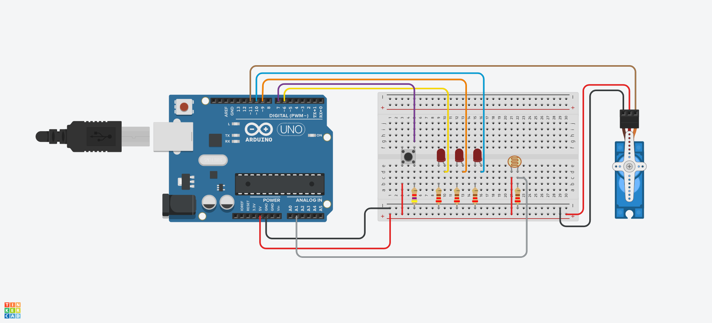

# Button_Count_LED
Button_Count_LEDs

+ **obo_LED**
  + button을 7번핀에 연결, LED를 각각 6,9,10번핀에 연결한다. 
  + button을 누를 때마다 6번핀에 연결한 LED부터 차례로 켜지고 LED가 다 켜지면 다시 처음 LED가 켜진다.
  
+ **Turn_LED_inOrder**
  + button을 7번핀에 연결, LED를 각각 6,9,10번핀에 연결한다. 
  + button을 누를 때마다 6번핀에 연결한 LED부터 차례로 켜지고 한번 더 누르면 전 LED가 꺼지고 다음 LED가 다 켜지는 것을 반복한다.
